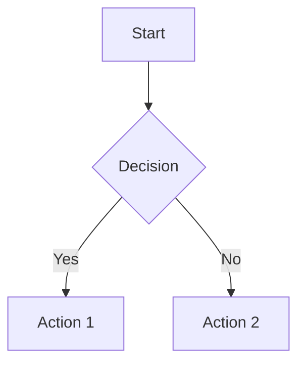

# VitePress Plugin Legend


A comprehensive VitePress plugin that integrates both Markmap and Mermaid diagram preview functionality for enhanced Markdown documentation.

[English](README.md) | [中文](README.zh-CN.md)

## ✨ Features

- 🗺️ **Markmap Integration**: Interactive mind map preview for Markdown
- 🏞️ **Mermaid Integration**: Interactive diagrams (flowcharts, sequence diagrams, etc.)
- 📊 **Infographic Integration**: AntV Infographic charts for data visualization
- 🎨 **Customizable**: Flexible configuration options for all plugins
- 🔧 **Easy Setup**: Single plugin installation with unified configuration
- 📁 **Component Support**: Vue components for Markmap, Mermaid, and Infographic
- 🚀 **TypeScript**: Full TypeScript support with type definitions

## 📦 Installation

```bash
npm install vitepress-plugin-legend
# or
pnpm add vitepress-plugin-legend
# or
yarn add vitepress-plugin-legend
```

## 🚀 Quick Start

### Step 1: Configure VitePress

Add the plugin to your VitePress configuration:

```typescript
// .vitepress/config.ts
import { defineConfig } from 'vitepress';
import { vitepressPluginLegend } from 'vitepress-plugin-legend';

export default defineConfig({
  markdown: {
    config(md) {
      vitepressPluginLegend(md);
    },
  },
});
```

### Step 2: Register Components

Register the Vue components in your theme:

```typescript
// .vitepress/theme/index.ts
import type { Theme } from 'vitepress';
import DefaultTheme from 'vitepress/theme';
import { initComponent } from 'vitepress-plugin-legend/component';
// 分别导入各个子包的 CSS
import 'vitepress-markmap-preview/dist/index.css';
import 'vitepress-mermaid-preview/dist/index.css';
import 'vitepress-infographic-preview/dist/index.css';

export default {
  extends: DefaultTheme,
  enhanceApp({ app }) {
    initComponent(app);
  },
} satisfies Theme;
```

### Advanced Configuration

```typescript
// .vitepress/config.ts
import { defineConfig } from 'vitepress';
import { vitepressPluginLegend } from 'vitepress-plugin-legend';

export default defineConfig({
  markdown: {
    config(md) {
      vitepressPluginLegend(md, {
        markmap: {
          showToolbar: true,
          // Other markmap options
        },
        mermaid: true, // or false to disable
        infographic: {
          showToolbar: false,
          // Other infographic options
        },
      });
    },
  },
});
```

### Using Individual Plugins

If you prefer to use plugins separately:

```typescript
// .vitepress/config.ts
import { defineConfig } from 'vitepress';
import {
  vitepressMarkmapPreview,
  vitepressMermaidPreview,
  vitepressInfographicPreview,
} from 'vitepress-plugin-legend';

export default defineConfig({
  markdown: {
    config(md) {
      vitepressMarkmapPreview(md, { showToolbar: true });
      vitepressMermaidPreview(md);
      vitepressInfographicPreview(md, { showToolbar: false });
    },
  },
});
```

```typescript
// .vitepress/theme/index.ts
import type { Theme } from 'vitepress';
import DefaultTheme from 'vitepress/theme';
import {
  initMarkmapComponent,
  initMermaidComponent,
  initInfographicComponent,
} from 'vitepress-plugin-legend/component';

export default {
  extends: DefaultTheme,
  enhanceApp({ app }) {
    initMarkmapComponent(app);
    initMermaidComponent(app);
    initInfographicComponent(app);
  },
} satisfies Theme;
```

## 📖 Usage in Markdown

### Markmap

Create mind maps from Markdown lists:

````markdown
```markmap
# Root
## Branch 1
- Item 1
- Item 2
## Branch 2
- Item A
- Item B
```

<PreviewMarkmapPath path="./other.md" showToolbar />
<PreviewMarkmapPath />
````

### Mermaid

Create various diagrams:

````markdown


<PreviewMermaidPath path="./other.mmd" />
````

### Infographic

Create AntV Infographic charts:

````markdown
```infographic
infographic list-row-simple-horizontal-arrow
data
  title Example Flow
  items
    - label Step 1
      desc Start
    - label Step 2
      desc In Progress
    - label Step 3
      desc Completed
```
````

Load from file:

```markdown
<PreviewInfographicPath path="./chart.igf" />

<PreviewInfographicPath path="./chart.igf" showToolbar />
```

## ⚙️ Configuration Options

### Markmap Options

```typescript
interface VitepressMarkmapPreviewOptions {
  showToolbar?: boolean;
  // Additional markmap configuration options
}
```

### Infographic Options

```typescript
interface VitepressInfographicPreviewOptions {
  showToolbar?: boolean;
}
```

### Plugin Options

```typescript
interface VitepressPluginLegendOptions {
  markmap?: VitepressMarkmapPreviewOptions | false;
  mermaid?: boolean;
  infographic?: VitepressInfographicPreviewOptions | false;
}
```

## 📦 Sub-packages

This plugin integrates the following packages:

| Package                                                                   | Description                             | Version                                                                |
| ------------------------------------------------------------------------- | --------------------------------------- | ---------------------------------------------------------------------- |
| [vitepress-markmap-preview](./packages/vitepress-markmap-preview)         | Markdown mind map preview plugin        |      |
| [vitepress-mermaid-preview](./packages/vitepress-mermaid-preview)         | Markdown Mermaid diagram preview plugin |      |
| [vitepress-infographic-preview](./packages/vitepress-infographic-preview) | AntV Infographic charts preview plugin  |  |

## 🤝 Contributing

Contributions are welcome! Please feel free to submit a Pull Request.

## 📄 License

[MIT License](https://github.com/flingyp/vitepress-plugin-legend/blob/main/LICENSE)

---

Made with ❤️ by [flingyp](https://github.com/flingyp)
