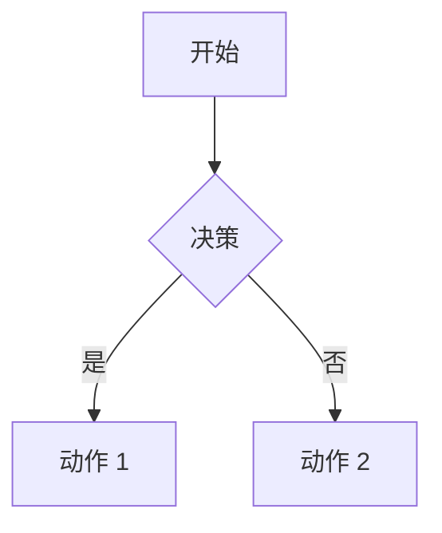

# VitePress Plugin Legend


一个综合性的 VitePress 插件，集成了 Markmap 和 Mermaid 图表预览功能，为 Markdown 文档提供增强的图表支持。

[English](README.md) | [中文](README.zh-CN.md)

## ✨ 特性

- 🗺️ **Markmap 集成**: Markdown 思维导图交互式预览
- 🏞️ **Mermaid 集成**: 交互式图表（流程图、时序图等）
- 🎨 **可定制**: 两个插件都支持灵活的配置选项
- 🔧 **简单设置**: 单个插件安装，统一配置
- 📁 **组件支持**: 提供 Markmap 和 Mermaid 的 Vue 组件
- 🚀 **TypeScript**: 完整的 TypeScript 支持和类型定义

## 📦 安装

```bash
npm install vitepress-plugin-legend
# 或
pnpm add vitepress-plugin-legend
# 或
yarn add vitepress-plugin-legend
```

## 🚀 快速开始

### 步骤 1：配置 VitePress

在 VitePress 配置中添加插件：

```typescript
// .vitepress/config.ts
import { defineConfig } from 'vitepress';
import { vitepressPluginLegend } from 'vitepress-plugin-legend';

export default defineConfig({
  markdown: {
    config(md) {
      vitepressPluginLegend(md);
    },
  },
});
```

### 步骤 2：注册组件

在主题中注册 Vue 组件：

```typescript
// .vitepress/theme/index.ts
import type { Theme } from 'vitepress';
import DefaultTheme from 'vitepress/theme';
import { initComponent } from 'vitepress-plugin-legend/component';
import 'vitepress-plugin-legend/dist/index.css';

export default {
  extends: DefaultTheme,
  enhanceApp({ app }) {
    initComponent(app);
  },
} satisfies Theme;
```

### 高级配置

```typescript
// .vitepress/config.ts
import { defineConfig } from 'vitepress';
import { vitepressPluginLegend } from 'vitepress-plugin-legend';

export default defineConfig({
  markdown: {
    config(md) {
      vitepressPluginLegend(md, {
        markmap: {
          showToolbar: true,
          // 其他 markmap 选项
        },
        mermaid: true, // 或 false 禁用
      });
    },
  },
});
```

### 单独使用插件

如果你更喜欢单独使用插件：

```typescript
// .vitepress/config.ts
import { defineConfig } from 'vitepress';
import {
  vitepressMarkmapPreview,
  vitepressMermaidPreview,
} from 'vitepress-plugin-legend';

export default defineConfig({
  markdown: {
    config(md) {
      vitepressMarkmapPreview(md, { showToolbar: true });
      vitepressMermaidPreview(md);
    },
  },
});
```

```typescript
// .vitepress/theme/index.ts
import type { Theme } from 'vitepress';
import DefaultTheme from 'vitepress/theme';
import {
  initMarkmapComponent,
  initMermaidComponent,
} from 'vitepress-plugin-legend/component';

export default {
  extends: DefaultTheme,
  enhanceApp({ app }) {
    initMarkmapComponent(app);
    initMermaidComponent(app);
  },
} satisfies Theme;
```

## 📖 在 Markdown 中使用

### Markmap

从 Markdown 列表创建思维导图：

````markdown
```markmap
# 根节点
## 分支 1
- 项目 1
- 项目 2
## 分支 2
- 项目 A
- 项目 B
```

<PreviewMarkmapPath path="./other.md" showToolbar />
<PreviewMarkmapPath />
````

### Mermaid

创建各种图表：

````markdown


<PreviewMermaidPath path="./other.mmd" />
````

## ⚙️ 配置选项

### Markmap 选项

```typescript
interface VitepressMarkmapPreviewOptions {
  showToolbar?: boolean;
  // 其他 markmap 配置选项
}
```

### 插件选项

```typescript
interface VitepressPluginLegendOptions {
  markmap?: VitepressMarkmapPreviewOptions | false;
  mermaid?: boolean;
}
```

## 📦 子包

此插件集成了以下包：

| 包名                                                              | 说明                          | 版本                                                               |
| ----------------------------------------------------------------- | ----------------------------- | ------------------------------------------------------------------ |
| [vitepress-markmap-preview](./packages/vitepress-markmap-preview) | Markdown 思维导图预览插件     |  |
| [vitepress-mermaid-preview](./packages/vitepress-mermaid-preview) | Markdown Mermaid 图表预览插件 |  |

## 🤝 贡献

欢迎贡献！请随时提交 Pull Request。

## 📄 许可证

[MIT License](https://github.com/flingyp/vitepress-plugin-legend/blob/main/LICENSE)

---

由 [flingyp](https://github.com/flingyp) 用 ❤️ 制作
