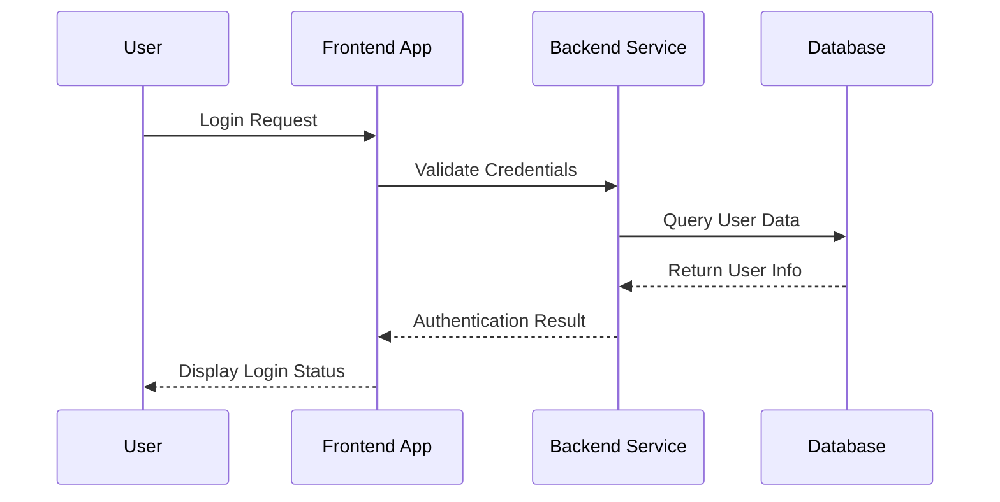

# Mermaid

## Code Block Format

Use `mermaid` code block format to insert Mermaid code block content:



```text
sequenceDiagram
    participant User as User
    participant Frontend as Frontend App
    participant Backend as Backend Service
    participant Database as Database

    User->>Frontend: Login Request
    Frontend->>Backend: Validate Credentials
    Backend->>Database: Query User Data
    Database-->>Backend: Return User Info
    Backend-->>Frontend: Authentication Result
    Frontend-->>User: Display Login Status
```

## Component Format

Use the `PreviewMermaidPath` component to read specified Mermaid file content and display it as a chart:

<PreviewMermaidPath path="./markmap.mmd" />

```vue
<!-- Recommend using .mermaid or .mmd file extensions -->
<PreviewMermaidPath path="./other.mmd" />
```
