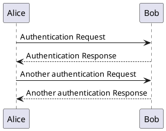
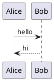

# PlantUML

## Fence: plantuml



## Fence: puml

`puml` is equivalent to `plantuml`.



## With toolbar (frontmatter)

```plantuml
---
showToolbar: true
---
@startuml
left to right direction
rectangle ModuleA
rectangle ModuleB
ModuleA --> ModuleB
@enduml
```



## Source reference

```text
@startuml
Alice -> Bob: hello
Bob --> Alice: hi
@enduml
```
