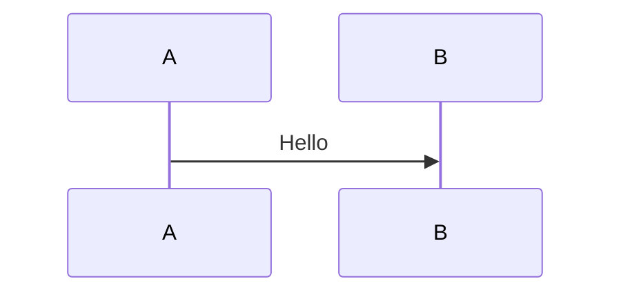

# Mermaid configuration

This page documents `vitepress-mermaid-preview` in VitePress.

## Plugin

### vitepressMermaidPreview

In `.vitepress/config.ts`:

```typescript
import { defineConfig } from 'vitepress';
import { vitepressMermaidPreview } from 'vitepress-mermaid-preview';

export default defineConfig({
  markdown: {
    config: (md) => {
      vitepressMermaidPreview(md, {
        showToolbar: false,
      });
    },
  },
});
```

### Options

| Option        | Type      | Default | Description |
| ------------- | --------- | ------- | ----------- |
| showToolbar   | `boolean` | plugin default if omitted | Global default toolbar; frontmatter can override per block |

## vitepress-plugin-legend

```typescript
import { vitepressPluginLegend } from 'vitepress-plugin-legend';

vitepressPluginLegend(md, {
  mermaid: {
    showToolbar: false,
  },
  // mermaid: false,
});
```

## Fence frontmatter

Example (outer `~~~` avoids the docs site treating it as a real diagram):

~~~markdown

~~~

| Option        | Type    | Description |
| ------------- | ------- | ----------- |
| showToolbar   | boolean | Toolbar for this diagram |

## Component: PreviewMermaidPath

```vue
<PreviewMermaidPath path="./diagram.mmd" />
<PreviewMermaidPath path="./diagram.mmd" showToolbar />
<PreviewMermaidPath showToolbar />
```

### Props

| Prop        | Type    | Description |
| ----------- | ------- | ----------- |
| path        | string  | Path to the Mermaid file relative to the current page (optional in some setups) |
| showToolbar | boolean | Whether to show the toolbar |

## Theme

The plugin follows light/dark mode and re-renders Mermaid when the theme changes.
