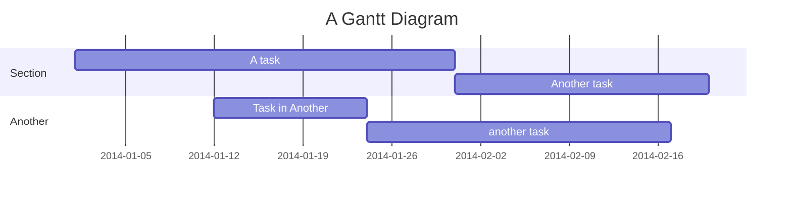

# VitePress Mermaid Preview


A plugin for displaying Mermaid charts in VitePress.

## ✨ Features

- 🗺️ **Mermaid Integration**: Directly render interactive mind maps in Markdown
- 🎨 **Customizable**: Support all mermaid configuration options
- 🔧 **Easy Setup**: One-click installation, quick configuration
- 📁 **Component Support**: Provide Vue components for mermaid rendering
- 🚀 **TypeScript**: Full TypeScript support with type definitions

## 📦 Installation

```bash
npm install vitepress-mermaid-preview
# or
yarn add vitepress-mermaid-preview
# or
pnpm add vitepress-mermaid-preview
```

## 🚀 Quick Start

Add the plugin in `.vitepress/config.js`:

```typescript
// .vitepress/config.ts
import { defineConfig } from 'vitepress';
import { vitepressMermaidPreview } from 'vitepress-mermaid-preview';

export default defineConfig({
  markdown: {
    config: (md) => {
      vitepressMermaidPreview(md);
    },
  },
});
```

Register global component in `.vitepress/theme/index.ts`:

```typescript
// .vitepress/theme/index.ts
import type { Theme } from 'vitepress';
import DefaultTheme from 'vitepress/theme';
import { initComponent } from 'vitepress-mermaid-preview/component';
import 'vitepress-mermaid-preview/dist/index.css';

export default {
  extends: DefaultTheme,
  enhanceApp({ app }) {
    initComponent(app);
  },
} satisfies Theme;
```

## 📖 Usage

### 📝 Basic Usage

You can directly use `mermaid` code blocks in Markdown to create charts:



```text
---
title: markmap
markmap:
  colorFreezeLevel: 2
---

## Links

- [Website](https://markmap.js.org/)
- [GitHub](https://github.com/gera2ld/markmap)

## Features

- **strong** ~~del~~ _italic_ ==highlight==
- `inline code`
- Lists support
- And more...
```

### 📂 Reading Files

Use the `PreviewMermaidPath` component to read specified Mermaid file content and display it as a chart:

```vue
<!-- Basic usage (default hide toolbar) -->
<PreviewMermaidPath path="./other.mmd" />

<!-- Show toolbar -->
<PreviewMermaidPath path="./other.mmd" showToolbar />

<!-- Read current file content -->
<PreviewMermaidPath showToolbar />
```

## ⚙️ Config Options

### PreviewMermaidPath Component Properties

| Property Name | Type   | Default | Description                          |
| ------------- | ------ | ------- | ------------------------------------ |
| path          | string | -       | The path of the Mermaid file to read |
| showToolbar   | string | -       | Whether to show the toolbar          |

## 📄 License

[MIT License](https://github.com/flingyp/vitepress-plugin-legend/blob/main/LICENSE)

## 🙏 Acknowledgments

- [mermaid](https://github.com/mermaid-js/mermaid)
- [VitePress](https://vitepress.dev/)
- [markdown-it](https://github.com/markdown-it/markdown-it)

---

Made with ❤️ by [flingyp](https://github.com/flingyp)
