# PlantUML configuration

This page documents `vitepress-plantuml-preview` in VitePress. Rendering always uses the **official PlantUML Server** (SVG). The only plugin option is **`showToolbar`**.

## Plugin

### vitepressPlantumlPreview

In `.vitepress/config.ts`:

```typescript
import { defineConfig } from 'vitepress';
import { vitepressPlantumlPreview } from 'vitepress-plantuml-preview';

export default defineConfig({
  markdown: {
    config: (md) => {
      vitepressPlantumlPreview(md, {
        showToolbar: false,
      });
    },
  },
});
```

If you omit the second argument or `showToolbar`, the toolbar defaults to **on** (`true`).

### Options

| Option        | Type      | Description |
| ------------- | --------- | ----------- |
| showToolbar   | `boolean` | Global toolbar; per-block frontmatter can override |

## vitepress-plugin-legend

```typescript
import { vitepressPluginLegend } from 'vitepress-plugin-legend';

vitepressPluginLegend(md, {
  plantuml: {
    showToolbar: false,
  },
  // plantuml: false,
});
```

Use `initComponent(app)` to register `PlantumlChart` (included in the legend `component` entry).

## Fence frontmatter

| Option        | Type    | Description |
| ------------- | ------- | ----------- |
| showToolbar   | boolean | Toolbar for this diagram |

````markdown

```plantuml
---
showToolbar: true
---
@startuml
class Demo
@enduml
```

````

## Privacy

Diagram **source** is sent to the official PlantUML service. Do not put secrets in diagrams.
