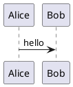
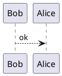
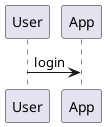

# VitePress PlantUML Preview


Preview PlantUML diagrams in VitePress using the **official PlantUML Server** (SVG).

## ✨ Features

- **Official server**: SVG output from `https://www.plantuml.com/plantuml`
- **Fenced code**: ` ```plantuml ` and ` ```puml `
- **Toolbar**: zoom, fit, copy source, PNG export, fullscreen (disable globally with `showToolbar: false`)
- **Privacy**: diagram source is sent to that service

## 📦 Installation

```bash
pnpm add vitepress-plantuml-preview
# or
npm install vitepress-plantuml-preview
```

## 🚀 Quick Start

Register the markdown-it plugin in `.vitepress/config.ts`:

```typescript
// .vitepress/config.ts
import { defineConfig } from 'vitepress';
import { vitepressPlantumlPreview } from 'vitepress-plantuml-preview';

export default defineConfig({
  markdown: {
    config: (md) => {
      vitepressPlantumlPreview(md);
      // or hide toolbar globally: vitepressPlantumlPreview(md, { showToolbar: false });
    },
  },
});
```

Register the Vue component and styles in `.vitepress/theme/index.ts`:

```typescript
// .vitepress/theme/index.ts
import type { Theme } from 'vitepress';
import DefaultTheme from 'vitepress/theme';
import { initComponent } from 'vitepress-plantuml-preview/component';
import 'vitepress-plantuml-preview/dist/index.css';

export default {
  extends: DefaultTheme,
  enhanceApp({ app }) {
    initComponent(app);
  },
} satisfies Theme;
```

## 📖 Usage

### Basic

````markdown

````

`puml` is an alias for `plantuml`:

````markdown

````

### Toolbar (frontmatter)

````markdown

````

## ⚙️ Options

See the [configuration guide](./configuration.md).

## 📄 License

[MIT License](https://github.com/flingyp/vitepress-plugin-legend/blob/main/LICENSE)
