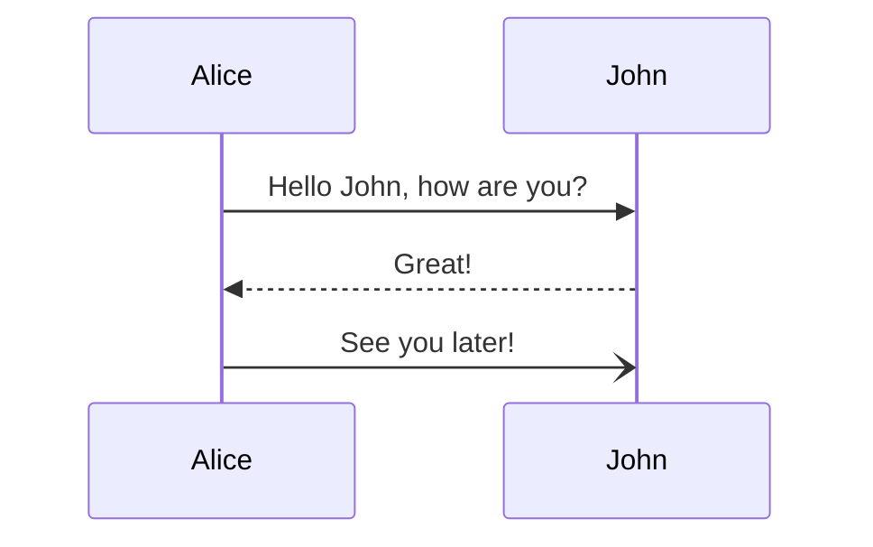

# Mermaid

## 代码块形式

使用 `mermaid` 代码块形式，插入 Mermaid 代码块内容



```text
sequenceDiagram
    Alice->>John: Hello John, how are you?
    John-->>Alice: Great!
    Alice-)John: See you later!
```

## 组件形式

使用 `PreviewMermaidPath` 组件可以读取指定的 Mermaid 文件内容并展示为图表：

<PreviewMermaidPath path="./markmap.mmd" />

```vue
<!-- 建议使用 .mermaid 或 .mmd 文件扩展名 -->
<PreviewMermaidPath path="./other.mmd" />
```
