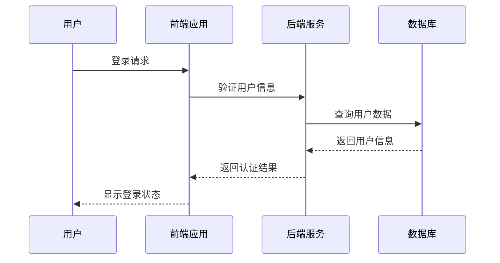

# Mermaid

## 代码块形式

使用 `mermaid` 代码块形式，插入 Mermaid 代码块内容



```text
sequenceDiagram
    participant 用户 as 用户
    participant 前端 as 前端应用
    participant 后端 as 后端服务
    participant 数据库 as 数据库

    用户->>前端: 登录请求
    前端->>后端: 验证用户信息
    后端->>数据库: 查询用户数据
    数据库-->>后端: 返回用户信息
    后端-->>前端: 返回认证结果
    前端-->>用户: 显示登录状态
```

## 组件形式

使用 `PreviewMermaidPath` 组件可以读取指定的 Mermaid 文件内容并展示为图表：

> `showToolbar` 是可选参数，默认情况下不显示工具栏。添加 `showToolbar` 参数可显示工具栏。

```vue
<!-- 指定路径读取指定文件（支持相对路径和绝对路径） -->
<PreviewMermaidPath path="./markmap.mmd" />
```

<PreviewMermaidPath path="./markmap.mmd" />

```vue
<!-- 显示工具栏 -->
<PreviewMermaidPath path="./markmap.mmd" showToolbar />
```

<PreviewMermaidPath path="./markmap.mmd" />
