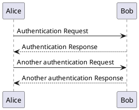
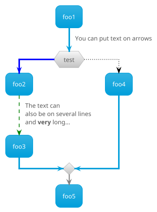
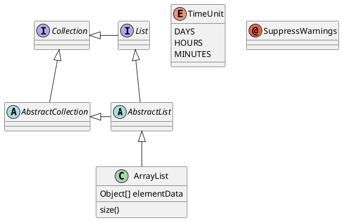

# PlantUML

## 代码块（plantuml）

使用 `plantuml` 围栏编写 PlantUML 源码（由插件固定请求官方 PlantUML Server 生成 SVG）。



## 代码块（puml）

`puml` 与 `plantuml` 等价。



## 类图



## 源码对照

```text
@startuml
Alice -> Bob: hello
Bob --> Alice: hi
@enduml
```
