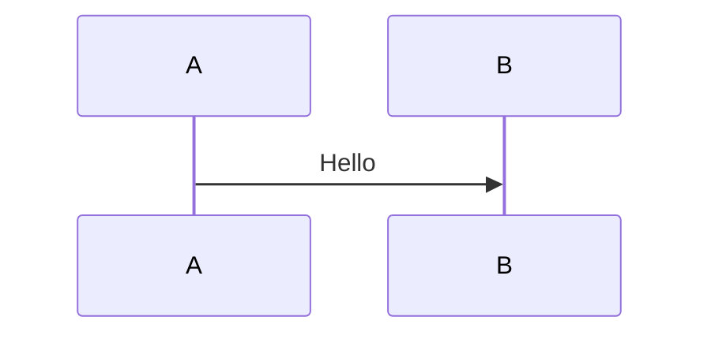

# Mermaid 配置指南

本页说明 `vitepress-mermaid-preview` 在 VitePress 中的配置方式。

## 插件配置

### vitepressMermaidPreview

在 `.vitepress/config.ts` 中：

```typescript
import { defineConfig } from 'vitepress';
import { vitepressMermaidPreview } from 'vitepress-mermaid-preview';

export default defineConfig({
  markdown: {
    config: (md) => {
      vitepressMermaidPreview(md, {
        showToolbar: false,
      });
    },
  },
});
```

### 选项

| 选项          | 类型      | 默认值 | 说明 |
| ------------- | --------- | ------ | ---- |
| showToolbar   | `boolean` | 未传时按插件内部默认 | 全局是否默认显示工具栏；单块可用 frontmatter 覆盖 |

## 聚合包 vitepress-plugin-legend

```typescript
import { vitepressPluginLegend } from 'vitepress-plugin-legend';

vitepressPluginLegend(md, {
  mermaid: {
    showToolbar: false,
  },
  // mermaid: false,
});
```

## 代码块 frontmatter

在 `mermaid` 围栏开头使用 YAML frontmatter（示意外层使用 `~~~` 避免被文档站解析为图表）：

~~~markdown

~~~

| 选项          | 类型    | 说明 |
| ------------- | ------- | ---- |
| showToolbar   | boolean | 是否显示该块图表的工具栏 |

## 组件：PreviewMermaidPath

在 Markdown 中引用外部 `.mmd` 等文件：

```vue
<PreviewMermaidPath path="./diagram.mmd" />
<PreviewMermaidPath path="./diagram.mmd" showToolbar />
<PreviewMermaidPath showToolbar />
```

### Props

| 属性        | 类型    | 说明 |
| ----------- | ------- | ---- |
| path        | string  | 相对当前 Markdown 的 Mermaid 文件路径（可选，省略时可配合当前页场景） |
| showToolbar | boolean | 是否显示工具栏 |

## 主题与重绘

插件会跟随文档站亮色 / 暗黑模式切换并重新渲染 Mermaid，无需额外配置。
