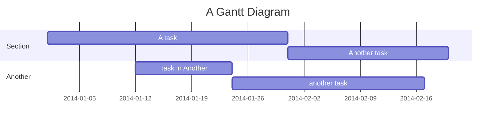

# vitepress-mermaid-preview

一个用于在 VitePress 中展示 Mermaid 图表的插件。

## 安装

```bash
npm install vitepress-mermaid-preview
```

## 使用方法

### 基本用法

可以直接在 Markdown 中使用 mermaid 代码块来创建图表：



### 读取文件

使用 `PreviewMermaidPath` 组件可以读取指定的 Mermaid 文件内容并展示为图表：

```vue
<PreviewMermaidPath path="./other.mmd" />
```
