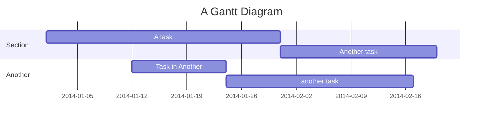

# vitepress-mermaid-preview

一个用于在 VitePress 中展示 Mermaid 图表的插件。

## 🚀 安装

```bash
npm install vitepress-mermaid-preview
# or
yarn add vitepress-mermaid-preview
# or
pnpm add vitepress-mermaid-preview
```

## ⚙️ 配置

在 `.vitepress/config.js` 中添加插件：

```typescript
// .vitepress/config.ts
import { defineConfig } from 'vitepress';
import { vitepressMermaidPreview } from 'vitepress-mermaid-preview';

export default defineConfig({
  markdown: {
    config: (md) => {
      vitepressMermaidPreview(md);
    },
  },
});
```

在 `.vitepress/theme/index.ts` 中注册全局组件：

```typescript
// .vitepress/theme/index.ts
import type { Theme } from 'vitepress';
import DefaultTheme from 'vitepress/theme';
import { initComponent } from 'vitepress-mermaid-preview/component';
import 'vitepress-mermaid-preview/dist/index.css';

export default {
  extends: DefaultTheme,
  enhanceApp({ app }) {
    initComponent(app);
  },
} satisfies Theme;
```

## 📖 使用方法

### 📝 基本用法

可以直接在 Markdown 中使用 `mermaid` 代码块来创建图表：



```text
---
title: markmap
markmap:
  colorFreezeLevel: 2
---

## Links

- [Website](https://markmap.js.org/)
- [GitHub](https://github.com/gera2ld/markmap)

## Features

- **strong** ~~del~~ _italic_ ==highlight==
- `inline code`
- Lists support
- And more...
```

### 📂 读取文件

使用 `PreviewMermaidPath` 组件可以读取指定的 Mermaid 文件内容并展示为图表：

```vue
<!-- 建议使用 .mermaid 或 .mmd 文件扩展名 -->
<PreviewMermaidPath path="./other.mmd" />
```

## 📄 License

[MIT License](https://github.com/flingyp/vitepress-plugin-legend/blob/main/LICENSE)

## 🙏 致谢

- [mermaid](https://github.com/mermaid-js/mermaid)
- [VitePress](https://vitepress.dev/)
- [markdown-it](https://github.com/markdown-it/markdown-it)

---

Made with ❤️ by [flingyp](https://github.com/flingyp)
