# PlantUML 配置指南

本页说明 `vitepress-plantuml-preview` 在 VitePress 中的配置方式。渲染固定使用官方 PlantUML Server 的 **SVG** 输出，插件侧仅 **`showToolbar`** 可配。

## 插件配置

### vitepressPlantumlPreview

在 `.vitepress/config.ts` 中：

```typescript
import { defineConfig } from 'vitepress';
import { vitepressPlantumlPreview } from 'vitepress-plantuml-preview';

export default defineConfig({
  markdown: {
    config: (md) => {
      vitepressPlantumlPreview(md, {
        showToolbar: false,
      });
    },
  },
});
```

未传第二参数或省略 `showToolbar` 时，**默认显示工具栏**（`true`）。

### 选项

| 选项          | 类型      | 说明 |
| ------------- | --------- | ---- |
| showToolbar   | `boolean` | 全局是否显示工具栏；单块仍可用 frontmatter 覆盖 |

## 聚合包 vitepress-plugin-legend

```typescript
import { vitepressPluginLegend } from 'vitepress-plugin-legend';

vitepressPluginLegend(md, {
  plantuml: {
    showToolbar: false,
  },
  // plantuml: false, // 关闭 PlantUML
});
```

主题侧通过 `initComponent(app)` 注册 `PlantumlChart`（legend 的 `component` 入口已包含）。

## 代码块 frontmatter

| 选项          | 类型    | 说明 |
| ------------- | ------- | ---- |
| showToolbar   | boolean | 是否显示该块对应图表的工具栏 |

````markdown

```plantuml
---
showToolbar: true
---
@startuml
class Demo
@enduml
```

````

## 隐私与网络

图表 **源码** 会发送到官方 PlantUML 在线服务。请勿在图中包含敏感数据。
