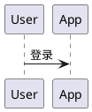

# VitePress PlantUML Preview


在 VitePress 中通过 **官方 PlantUML Server**（SVG）预览 `plantuml` / `puml` 代码块的插件。

## ✨ 特性

- **固定官方服务**：使用 `https://www.plantuml.com/plantuml` 的 SVG 输出
- **围栏语法**：支持 ` ```plantuml ` 与 ` ```puml `
- **工具栏**：缩放、适应、复制源码、导出 PNG、全屏（可通过 `showToolbar: false` 全局关闭）
- **隐私提示**：图表源码会发送到上述服务

## 📦 安装

```bash
pnpm add vitepress-plantuml-preview
# 或
npm install vitepress-plantuml-preview
```

## 🚀 快速开始

在 `.vitepress/config.ts` 中注册 markdown-it 插件：

```typescript
// .vitepress/config.ts
import { defineConfig } from 'vitepress';
import { vitepressPlantumlPreview } from 'vitepress-plantuml-preview';

export default defineConfig({
  markdown: {
    config: (md) => {
      vitepressPlantumlPreview(md);
      // 或全局关闭工具栏：vitepressPlantumlPreview(md, { showToolbar: false });
    },
  },
});
```

在 `.vitepress/theme/index.ts` 中注册组件并引入样式：

```typescript
// .vitepress/theme/index.ts
import type { Theme } from 'vitepress';
import DefaultTheme from 'vitepress/theme';
import { initComponent } from 'vitepress-plantuml-preview/component';
import 'vitepress-plantuml-preview/dist/index.css';

export default {
  extends: DefaultTheme,
  enhanceApp({ app }) {
    initComponent(app);
  },
} satisfies Theme;
```

## 📖 使用方法

### 基本用法

````markdown

````

`puml` 语言标记与 `plantuml` 等价：

````markdown

````

### 工具栏（frontmatter）

````markdown

````

## ⚙️ 配置

详见 [配置指南](./configuration.md)。

## 📄 License

[MIT License](https://github.com/flingyp/vitepress-plugin-legend/blob/main/LICENSE)
