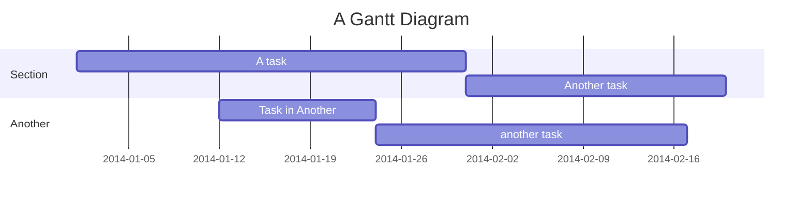
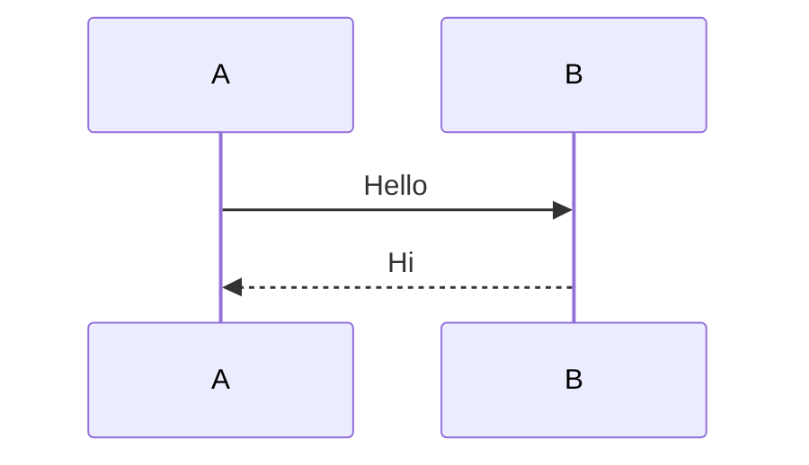

# vitepress-mermaid-preview

A plugin for displaying Mermaid diagrams in VitePress.

[](https://www.npmjs.com/package/vitepress-mermaid-preview)
[](https://github.com/flingyp/vitepress-mermaid-preview/blob/main/LICENSE)

## 🚀 Installation

```bash
npm install vitepress-mermaid-preview
# or
yarn add vitepress-mermaid-preview
# or
pnpm add vitepress-mermaid-preview
```

## ⚙️ Configuration

Add the plugin in `.vitepress/config.ts`:

```typescript
// .vitepress/config.ts
import { defineConfig } from 'vitepress';
import { vitepressMermaidPreview } from 'vitepress-mermaid-preview';

export default defineConfig({
  markdown: {
    config: (md) => {
      vitepressMermaidPreview(md, {
        showToolbar: false, // Global setting: whether to show toolbar by default
      });
    },
  },
});
```

Register the global component in `.vitepress/theme/index.ts`:

```typescript
// .vitepress/theme/index.ts
import type { Theme } from 'vitepress';
import DefaultTheme from 'vitepress/theme';
import { initComponent } from 'vitepress-mermaid-preview/component';
import 'vitepress-mermaid-preview/dist/index.css';

export default {
  extends: DefaultTheme,
  enhanceApp({ app }) {
    initComponent(app);
  },
} satisfies Theme;
```

## 📖 Usage

### 📝 Basic Usage

You can directly use Mermaid code blocks in Markdown to create diagrams:



### 🔧 Toolbar Control

You can control toolbar visibility using frontmatter in code blocks:



### 📂 Load from File

Use the `PreviewMermaidPath` component to load and display Mermaid diagrams from a specified file:

```vue
<!-- Basic usage (toolbar hidden by default) -->
<PreviewMermaidPath path="./other.mmd" />

<!-- Show toolbar -->
<PreviewMermaidPath path="./other.mmd" showToolbar />
```

## ⚙️ Component Options

### PreviewMermaidPath Props

| Prop        | Type    | Default | Description                      |
| ----------- | ------- | ------- | -------------------------------- |
| path        | string  | -       | Path to the Mermaid file to load |
| showToolbar | boolean | false   | Whether to show the toolbar      |

## 📄 License

- [MIT](https://github.com/flingyp/vitepress-plugin-legend/blob/main/LICENSE)

## 🙏 Acknowledgments

- [mermaid](https://github.com/mermaid-js/mermaid)
- [VitePress](https://vitepress.dev/)
- [markdown-it](https://github.com/markdown-it/markdown-it)

---

Made with ❤️ by [flingyp](https://github.com/flingyp)
