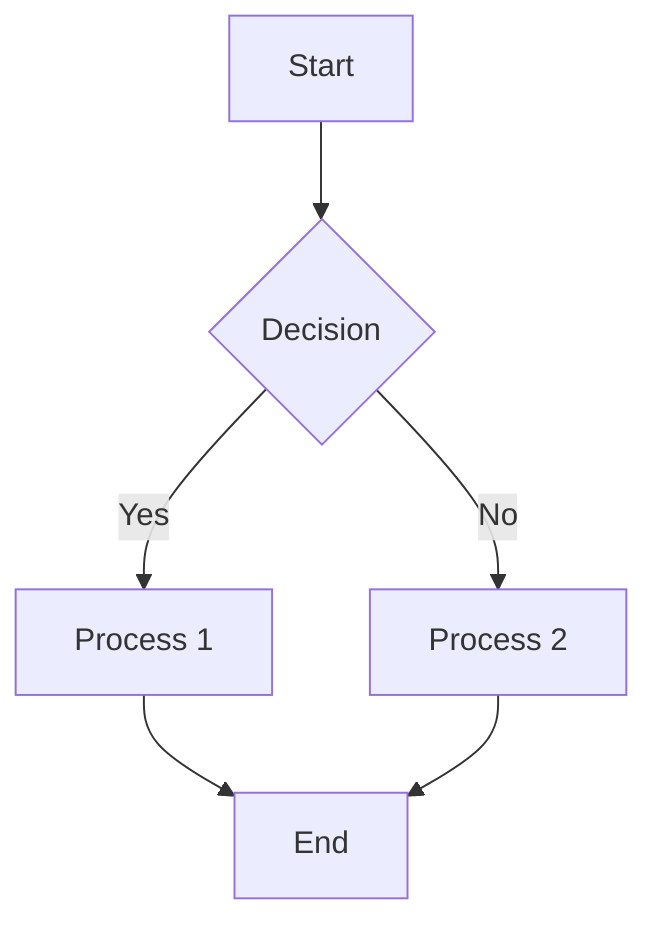

# vitepress-mermaid-preview

A VitePress plugin that enables interactive Mermaid diagram previews in Markdown.

[](https://www.npmjs.com/package/vitepress-mermaid-preview)
[](https://github.com/flingyp/vitepress-mermaid-preview/blob/main/LICENSE)

## ✨ Features

- 🏞️ Interactive Mermaid diagrams in Markdown
- 📝 Supports flowcharts, sequence diagrams, etc.
- 🎨 Customizable themes and options
- 🔧 Seamless integration with VitePress
- 📁 File preview via component tag

## 🚀 Quick Start

### Installation

```bash
npm install vitepress-mermaid-preview
# or
yarn add vitepress-mermaid-preview
# or
pnpm add vitepress-mermaid-preview
```

### Usage

1. **Configure VitePress**

```typescript
// .vitepress/config.ts
import { defineConfig } from 'vitepress';
import { vitepressMermaidPreview } from 'vitepress-mermaid-preview';

export default defineConfig({
  markdown: {
    config: (md) => {
      vitepressMermaidPreview(md);
    },
  },
});
```

Register global components (if needed):

```typescript
// .vitepress/theme/index.ts
import type { Theme } from 'vitepress';
import DefaultTheme from 'vitepress/theme';
import { initComponent } from 'vitepress-mermaid-preview/component';
import 'vitepress-mermaid-preview/dist/index.css';

export default {
  extends: DefaultTheme,
  enhanceApp({ app }) {
    initComponent(app);
  },
} satisfies Theme;
```

2. **Use in Markdown**

#### Method 1: Mermaid Code Block

````markdown

````

#### Method 2: Component Tag

```markdown
<PreviewMermaidPath path="./path/to/file.mmd" />
```

## 📄 License

MIT

## 🙏 Acknowledgments

- [mermaid](https://github.com/mermaid-js/mermaid)
- [VitePress](https://vitepress.dev/)
- [markdown-it](https://github.com/markdown-it/markdown-it)

---

Made with ❤️ by [flingyp](https://github.com/flingyp)
